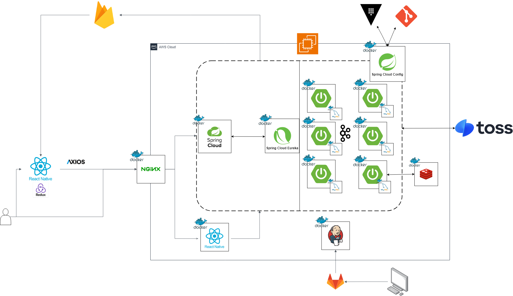
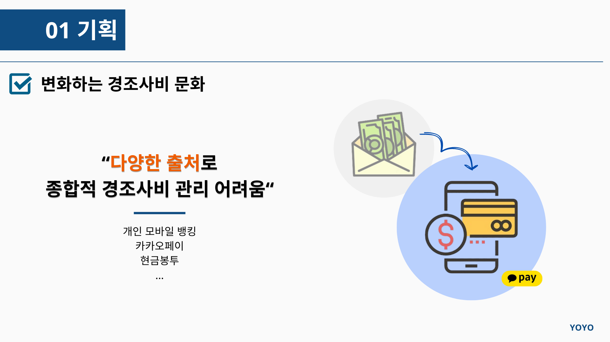
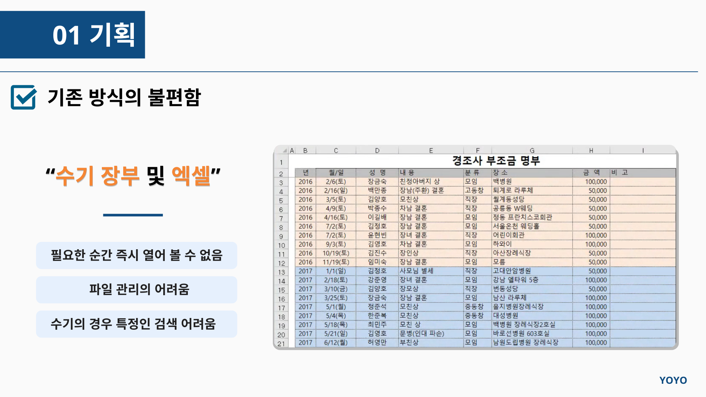
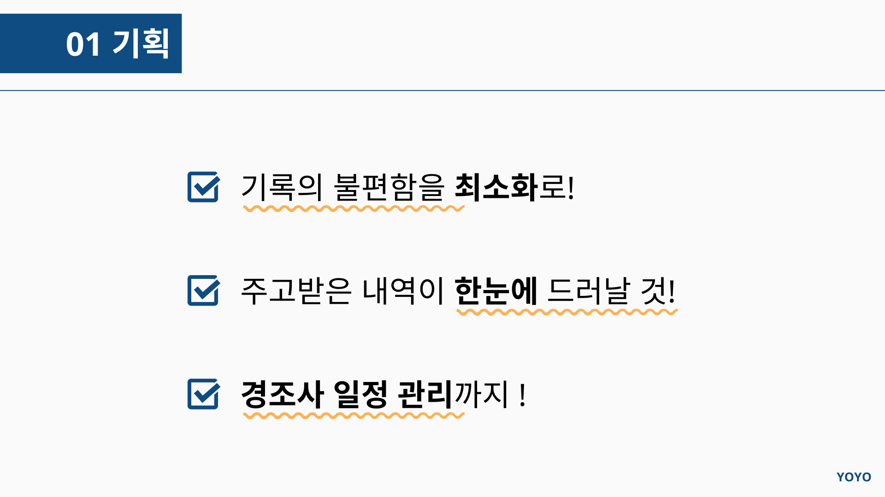
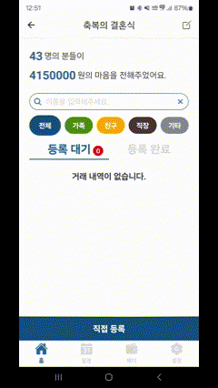
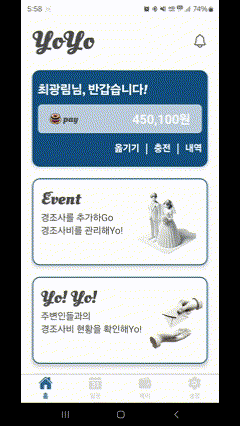
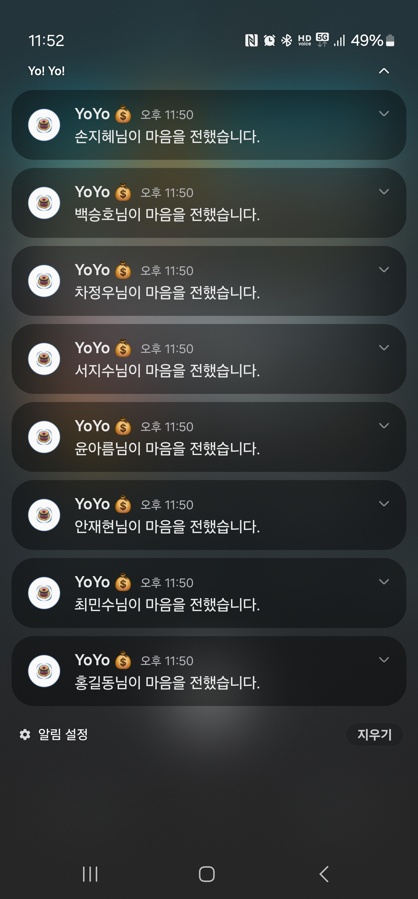
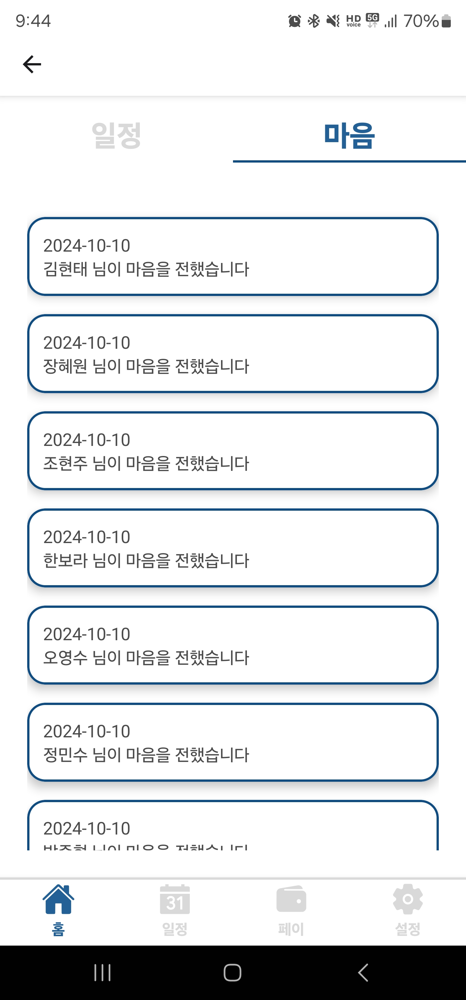

# 🪀 Yo!Yo! 🪀

# 📖프로젝트 소개

이벤트가 끝나고 돈 거래를 정리하기 힘들다면!!

YoYo를 통해 경조사비를 간편하게 관리하세요!

계좌를 등록하여 이벤트를 통해 지인과 페이머니 거래를 할 수 있습니다.

내가 개최한 이벤트의 QR코드 및 URL을 통해 누구에게나 마음 전할 곳을 알릴 수 있습니다.

작성한 장부를 사진 촬영을 통해 빠르게 기록을 저장할 수 있습니다.

# 📖개발 환경

### 🔧 BackEnd

  
    
  

  

  Openjdk:17-JDK-alpine 
  Intelij:2024.01 
Spring Boot:3.3.2
    

---

### 🎨 FrontEnd

  
  
  

Android Studio:2024.01 
Android API:35 
React-Native:3.22.3 
Npm 9.2.0

---

### 🗄️ DataBase

  
  
  

  MySQL:8.0
  
   Redis:alpine
  

---

### 🛠 Infra

  
  
    

  AWS EC2 Ubuntu 20.04.6 LTS
  

# 🛠️ 사용 도구

### 📝 이슈 관리

**프로젝트 이슈와 일정 관리를 위한 도구입니다.**

---

### 💾 형상 관리

**버전 관리 및 코드 형상 관리를 위한 GitLab을 사용합니다.**

---

### 💬 커뮤니케이션

  

**팀 내 문서 공유 및 실시간 커뮤니케이션을 위한 도구입니다.**

---

### 🎨 디자인

**UI/UX 디자인 협업을 위한 도구입니다.**

---

### ⚙️ CI/CD

**자동 빌드 및 배포 관리를 위한 Jenkins를 사용합니다.**

# 🏗️시스템 아키텍처

# 📝기획

<table align="center">
  <tr>
    <td></td>
    <td></td>
    <td></td>
  </tr>
</table>

# 📄 명세서

프로젝트의 주요 명세서와 문서들을 확인할 수 있습니다.

### 📋 요구 사항 명세서

[🔗 요구 사항 명세서 보기](https://docs.google.com/spreadsheets/d/1vXI50DEy7T1m6U_-cBndaAqHpatty2hZtrPbOcFo_eY/edit?gid=0#gid=0)  
프로젝트에서 요구하는 기능 및 요구 사항들을 정리한 문서입니다.

---

### 🖼️ 와이어 프레임

[🔗 와이어 프레임 보기](https://www.figma.com/design/GHScAyjAlD6kMdfoWoZRvL/Untitled?node-id=0-1&m=dev&t=Q4ZNNhtFrOs5a9L4-1)  
서비스 화면의 UI 설계를 확인할 수 있는 와이어 프레임입니다.

---

### 🗂️ ERD Diagram

[🔗 ERD Diagram 보기](https://www.erdcloud.com/d/KEihe68iHdjzxxxBh)  
데이터베이스의 구조를 시각적으로 표현한 ERD 다이어그램입니다.

---

### 📑 API 명세서

[🔗 API 명세서 보기](https://docs.google.com/spreadsheets/d/1vXI50DEy7T1m6U_-cBndaAqHpatty2hZtrPbOcFo_eY/edit?gid=1657403701#gid=1657403701)  
프로젝트에서 사용되는 API의 기능과 상세 내용을 기록한 명세서입니다.

# 🌟 주요 기능

### ⭐️ OCR(Optical Character Recognition)

**📄 광학 문자 인식 (Optical Character Recognition)** 을 통해 **장부를 스캔**하여 편리하고 빠르게 기록합니다.

|      **OCR 인식 과정**      |
| :-------------------------: |
|  |

---

### ⭐️ YoYo 페이 서비스

**💸 간편 송금 및 기록**  
YoYo 페이를 통해 경조사비를 **손쉽게 송금**하고 관리합니다.  
비회원을 위한 **결제 시스템**을 통해 **비회원도 송금**할 수 있습니다.

|                **페이 서비스**                 |                **비회원 결제**                |
| :--------------------------------------------: | :-------------------------------------------: |
|  |  |

---

### ⭐️ 알림

**📅 알림 및 일정 관리**  
알림을 통해 참석하고자 하는 경조사를 **일정에 등록**하고 **마음 내역**을 확인합니다.

|              **PUSH 알림**               |              **앱 내 알림**              |
| :--------------------------------------: | :--------------------------------------: |
|  |  |

---

# 👥 팀원

<table>
  <tr>
    <th align="center">김찬규</th>
    <th align="center">김현태</th>
    <th align="center">서진경</th>
    <th align="center">이찬진</th>
    <th align="center">장혜원</th>
    <th align="center">최광림</th>
  </tr>
  <tr>
    <td align="center"></td>
    <td align="center"></td>
    <td align="center"></td>
    <td align="center"></td>
    <td align="center"></td>
    <td align="center"></td>
  </tr>
  <tr>
    <td align="center">
      
    </td>
    <td align="center">
      
    </td>
    <td align="center">
      
    </td>
    <td align="center">
      
    </td>
    <td align="center">
      
    </td>
    <td align="center">
      
    </td>
  </tr>
</table>
